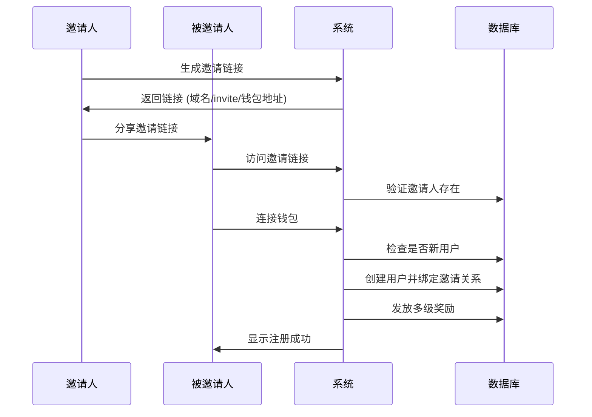

# 新邀请系统说明

## 概述

Angel Crypto App 的邀请系统已完全重构，采用更简洁的设计：**直接使用钱包地址作为邀请标识**，无需推荐码。

## 🚀 新特性

### 1. 简化的邀请链接
- **格式**: `https://www.angelcoin.app/invite/[钱包地址]`
- **示例**: `https://www.angelcoin.app/invite/0x742d35Cc6634C0532925a3b8D8bE0b3f4f8C8A8e`
- **优势**: 更直观、更易理解、减少错误

### 2. 自动化流程
- 新用户通过邀请链接首次连接钱包时自动注册
- 自动绑定邀请关系
- 自动发放多级奖励
- 无需手动输入推荐码

### 3. 多级奖励机制
- **新用户奖励**: 100 ANGEL 代币
- **一级邀请奖励**: 50 ANGEL 代币
- **二级邀请奖励**: 25 ANGEL 代币  
- **三级邀请奖励**: 10 ANGEL 代币

## 📋 数据库更新

### 必需的数据库更新
请执行以下SQL脚本来更新数据库结构：

```sql
-- 执行数据库更新脚本
\i database-update-invite-system.sql
```

### 主要变更
1. **移除字段**:
   - `users.referral_code` - 不再需要推荐码
   - `invitations.referral_code` - 不再需要推荐码
   - `invitations.invite_link` - 动态生成

2. **新增字段**:
   - `users.level` - 用户等级
   - `invitations.inviter_wallet_address` - 邀请人钱包地址

3. **新增函数**:
   - `process_invite_registration()` - 处理邀请注册
   - `is_new_user()` - 检查是否为新用户
   - `generate_invite_link()` - 生成邀请链接

## 🔧 技术实现

### 1. 邀请流程



### 2. 核心组件更新

#### AuthContext (`lib/auth-context.tsx`)
- 更新 `login()` 函数支持邀请人钱包地址参数
- 移除推荐码相关逻辑
- 添加自动邀请关系处理

#### DatabaseService (`lib/database.ts`)  
- 新增 `processInviteRegistration()` 方法
- 新增 `isNewUser()` 方法
- 更新数据类型定义
- 简化邀请链接生成逻辑

#### 邀请页面 (`app/invite/[code]/page.tsx`)
- 直接使用钱包地址作为邀请参数
- 改进用户体验和错误处理
- 添加注册成功状态显示

#### 邀请系统组件 (`components/auth/invite-system.tsx`)
- 移除推荐码相关UI
- 显示钱包地址而非推荐码
- 简化邀请链接生成

## 🧪 测试

### 测试页面
访问 `/test-invite-new` 页面进行完整测试：

1. **功能测试**:
   - 邀请链接生成
   - 新用户检测
   - 邀请关系绑定
   - 奖励发放

2. **测试步骤**:
   ```bash
   # 启动开发服务器
   npm run dev
   
   # 访问测试页面
   http://localhost:3000/test-invite-new
   
   # 连接钱包并测试功能
   ```

### 验证要点
- ✅ 邀请链接格式正确: `域名/invite/钱包地址`
- ✅ 新用户自动注册并获得100代币
- ✅ 邀请人获得50代币一级奖励
- ✅ 多级奖励正确分配
- ✅ 邀请记录正确创建

## 🎯 用户体验改进

### 1. 更简单的分享
- 无需记忆复杂的推荐码
- 钱包地址更容易验证和信任
- 减少输入错误的可能性

### 2. 更快的注册
- 一键连接钱包即可完成注册
- 自动处理邀请关系
- 即时获得奖励反馈

### 3. 更清晰的状态
- 实时显示注册进度
- 明确的成功/失败状态
- 详细的奖励信息

## 📱 移动端优化

### 响应式设计
- 邀请页面完全响应式
- 移动端友好的UI组件
- 触摸优化的交互元素

### 分享功能
- 支持原生分享API
- 自动复制到剪贴板
- 社交媒体分享优化

## 🔒 安全考虑

### 1. 钱包地址验证
- 严格的地址格式检查
- 防止无效地址攻击
- 大小写不敏感处理

### 2. 重复注册防护
- 检查用户是否已存在
- 防止重复奖励发放
- 事务性数据操作

### 3. 错误处理
- 优雅的错误降级
- 详细的错误日志
- 用户友好的错误提示

## 🚀 部署指南

### 1. 数据库更新
```bash
# 连接到生产数据库
psql -h your-db-host -U your-username -d your-database

# 执行更新脚本
\i database-update-invite-system.sql
```

### 2. 环境变量
确保以下环境变量正确设置：
```env
NEXT_PUBLIC_APP_URL=https://www.angelcoin.app
NEXT_PUBLIC_SUPABASE_URL=your-supabase-url
NEXT_PUBLIC_SUPABASE_ANON_KEY=your-supabase-anon-key
```

### 3. 验证部署
- 测试邀请链接生成
- 验证新用户注册流程
- 检查奖励发放机制
- 确认数据库连接正常

## 📊 监控和分析

### 关键指标
- 邀请链接点击率
- 新用户转化率
- 奖励发放准确性
- 系统响应时间

### 日志记录
- 邀请关系创建日志
- 奖励发放日志
- 错误和异常日志
- 用户行为分析

## 🎉 总结

新的邀请系统提供了：
- **更简单**的用户体验
- **更可靠**的技术实现
- **更高效**的奖励机制
- **更安全**的数据处理

通过直接使用钱包地址作为邀请标识，我们消除了推荐码的复杂性，同时保持了强大的多级奖励功能。

---

如有问题，请查看测试页面 `/test-invite-new` 或联系开发团队。 